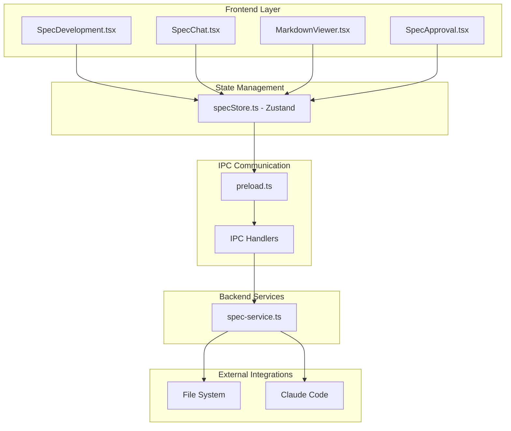
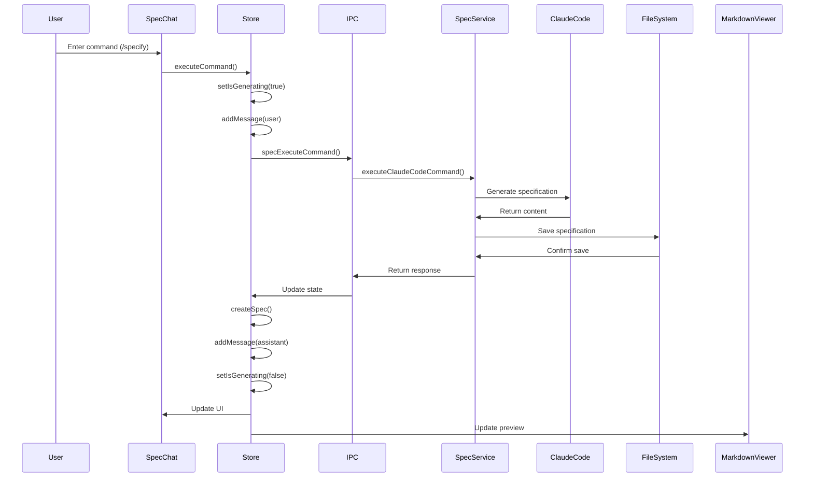
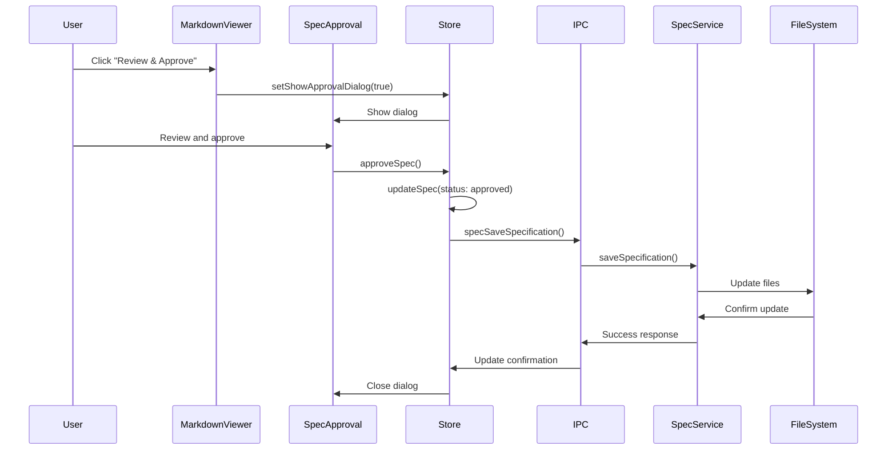

# Spec Development Architecture

## Overview

The Spec Development feature is built using a layered architecture that separates concerns between the user interface, state management, and backend services. This document provides a detailed technical overview of the architecture.

## System Architecture



## Component Architecture

### Frontend Components

#### 1. SpecDevelopment.tsx (Main Container)
- **Purpose**: Root component orchestrating the entire spec development feature
- **Responsibilities**:
  - Layout management and view mode switching
  - Project initialization and management
  - Component composition and data flow coordination
- **Key Features**:
  - Three view modes: chat, split, and preview
  - Project creation and selection
  - Loading and error state management

#### 2. SpecChat.tsx (Interactive Chat)
- **Purpose**: Chat interface for interacting with Claude Code
- **Responsibilities**:
  - Message display and input handling
  - Command suggestion and autocomplete
  - Real-time conversation management
- **Key Features**:
  - Support for spec-kit commands (`/specify`, `/plan`, `/tasks`, `/refine`)
  - Message history with timestamps and metadata
  - Loading states and error handling
  - Copy and export message functionality

#### 3. MarkdownViewer.tsx (Specification Preview)
- **Purpose**: Real-time markdown rendering with syntax highlighting
- **Responsibilities**:
  - Markdown parsing and rendering
  - Code syntax highlighting
  - Interactive editing capabilities
- **Key Features**:
  - GitHub Flavored Markdown support
  - Syntax highlighting for code blocks
  - Table rendering with responsive design
  - Export functionality (markdown, PDF, HTML)

#### 4. SpecApproval.tsx (Approval Workflow)
- **Purpose**: Specification review and approval interface
- **Responsibilities**:
  - Specification quality review
  - Tag management and categorization
  - Approval/rejection workflow
- **Key Features**:
  - Star rating system (1-5 stars)
  - Tag addition and management
  - Feedback collection
  - Status change tracking

### State Management Layer

#### Zustand Store (specStore.ts)

The application uses Zustand for state management, providing a centralized store for:

```typescript
interface SpecStore {
  // Chat State
  messages: ChatMessage[]
  isStreaming: boolean
  currentCommand: string | null

  // Specification State
  specifications: Specification[]
  currentSpec: Specification | null
  activeProject: SpecProject | null

  // Project State
  projects: SpecProject[]

  // UI State
  isGenerating: boolean
  showApprovalDialog: boolean
  selectedSpecId: string | null
  viewMode: 'chat' | 'split' | 'preview'

  // Actions
  // ... (comprehensive action methods)
}
```

**Store Architecture Benefits**:
- Centralized state management
- Reactive updates across components
- Separation of business logic from UI
- Easy testing and debugging
- Performance optimization through selective subscriptions

### IPC Communication Layer

#### Preload Script (preload.ts)

The preload script exposes secure APIs to the renderer process:

```typescript
const electronAPI = {
  // Existing APIs...

  // Spec Development APIs
  specCreateProject: (projectData: any) => ipcRenderer.invoke('spec-create-project', projectData),
  specGetProjects: () => ipcRenderer.invoke('spec-get-projects'),
  specSaveSpecification: (projectId: string, spec: any) => ipcRenderer.invoke('spec-save-specification', projectId, spec),
  // ... additional methods
}
```

**Security Considerations**:
- Context isolation enabled
- Limited API surface exposure
- Input validation on both sides
- No direct Node.js API access from renderer

#### IPC Handlers (main.ts)

The main process handles IPC communications:

```typescript
// Example IPC handler
ipcMain.handle('spec-execute-command', async (_, command, content, projectPath) => {
  try {
    return await specService.executeClaudeCodeCommand(command, content, projectPath, mainWindow)
  } catch (error) {
    console.error('Error executing command:', error)
    throw error
  }
})
```

### Backend Services Layer

#### SpecService (spec-service.ts)

The core backend service handling all specification operations:

**Architecture Pattern**: Service Layer Pattern
- Encapsulates business logic
- Manages file system operations
- Handles external integrations
- Provides data persistence

**Key Responsibilities**:
1. **Project Management**: CRUD operations for projects
2. **Specification Storage**: File-based storage with metadata
3. **Claude Code Integration**: Command execution and response handling
4. **Export Services**: Multiple format support
5. **Statistics and Analytics**: Usage tracking and reporting

### File System Architecture

#### Directory Structure

```
~/.claude-sentinel/specs/
├── config.json                 # Global configuration
├── projects/                   # Project storage
│   └── [project-id]/
│       ├── project.json        # Project metadata
│       ├── specs/              # Specification files
│       │   ├── [spec-id].json # Specification metadata
│       │   └── [spec-id].md   # Specification content
│       └── templates/          # Project-specific templates
└── templates/                  # Global templates
```

**Storage Strategy**:
- JSON for structured metadata
- Markdown for specification content
- Hierarchical organization by project
- Version control through metadata tracking

## Data Flow Architecture

### Command Execution Flow



### Specification Approval Flow



## Integration Architecture

### Claude Code Integration

The system integrates with Claude Code through a service-based approach:

```typescript
class SpecService {
  async executeClaudeCodeCommand(
    command: string,
    content: string,
    projectPath: string,
    window?: BrowserWindow
  ): Promise<string> {
    // Build spec-kit style prompt
    const fullPrompt = this.buildSpecKitPrompt(command, content)

    // For now, return simulated response
    // Future: Interface with actual Claude Code session
    return this.generateMockResponse(command, content)
  }

  private buildSpecKitPrompt(command: string, content: string): string {
    // Convert spec-kit commands to structured prompts
    switch (command) {
      case '/specify':
        return `Create a detailed specification for: ${content}...`
      // ... other commands
    }
  }
}
```

**Future Integration Options**:
1. **Direct API Integration**: Connect to Claude API
2. **Session Sharing**: Share Claude Code session state
3. **Plugin Architecture**: Extend Claude Code with spec-kit plugin
4. **Webhook Integration**: Real-time updates from Claude Code

### File System Integration

**Storage Pattern**: Repository Pattern
- Abstracted file operations
- Consistent data access layer
- Transaction-like operations
- Backup and recovery capabilities

**Key Design Decisions**:
1. **Dual Format Storage**: JSON for metadata, Markdown for content
2. **Hierarchical Organization**: Projects contain specifications
3. **Version Control**: Metadata tracking for changes
4. **Export Flexibility**: Multiple output formats

## Security Architecture

### Frontend Security

1. **Context Isolation**: Renderer process isolation
2. **Limited API Surface**: Minimal IPC exposure
3. **Input Validation**: Client-side validation
4. **XSS Prevention**: Sanitized markdown rendering

### Backend Security

1. **File System Sandboxing**: Restricted to user data directory
2. **Input Sanitization**: All user inputs validated
3. **Error Handling**: Secure error messages
4. **Permission Management**: File access controls

### IPC Security

1. **Structured Communication**: Defined message formats
2. **Error Boundaries**: Isolated error handling
3. **Resource Limits**: Prevent resource exhaustion
4. **Audit Logging**: Operation tracking

## Performance Architecture

### Frontend Optimization

1. **Component Memoization**: React.memo for expensive components
2. **Lazy Loading**: Code splitting and dynamic imports
3. **Virtualization**: Large list performance
4. **Debounced Operations**: Search and input handling

### Backend Optimization

1. **Caching Strategy**: In-memory caching for frequently accessed data
2. **Streaming Operations**: Large file handling
3. **Background Processing**: Non-blocking operations
4. **Resource Pooling**: Efficient resource utilization

### Memory Management

1. **Store Optimization**: Selective state subscriptions
2. **File Handling**: Streaming for large specifications
3. **Cleanup Operations**: Proper resource disposal
4. **Garbage Collection**: Optimized object lifecycle

## Scalability Considerations

### Horizontal Scaling

1. **Project Isolation**: Independent project storage
2. **Stateless Services**: Service layer without session state
3. **External Storage**: Future cloud storage integration
4. **API Versioning**: Backward compatibility support

### Vertical Scaling

1. **Resource Monitoring**: Memory and CPU usage tracking
2. **Performance Metrics**: Operation timing and throughput
3. **Optimization Points**: Identified bottlenecks and solutions
4. **Capacity Planning**: Resource requirement projections

## Error Handling Architecture

### Error Categories

1. **User Errors**: Invalid input, missing data
2. **System Errors**: File system, network issues
3. **Integration Errors**: Claude Code communication failures
4. **Resource Errors**: Memory, disk space limitations

### Error Handling Strategy

```typescript
// Store error handling
try {
  await window.electronAPI.specExecuteCommand(command, content, projectPath)
} catch (error) {
  get().addMessage({
    type: 'system',
    content: `Error executing command: ${error instanceof Error ? error.message : 'Unknown error'}`,
  })
}

// Service error handling
async saveSpecification(projectId: string, spec: Specification): Promise<void> {
  try {
    const projectPath = path.join(this.specDir, 'projects', projectId)
    // ... save operations
  } catch (error) {
    console.error('Error saving specification:', error)
    throw new Error(`Failed to save specification: ${error.message}`)
  }
}
```

## Testing Architecture

### Test Strategy

1. **Unit Tests**: Individual component and service testing
2. **Integration Tests**: IPC communication and service integration
3. **End-to-End Tests**: Complete user workflow testing
4. **Performance Tests**: Load and stress testing

### Test Structure

```
tests/
├── unit/
│   ├── components/
│   ├── stores/
│   └── services/
├── integration/
│   ├── ipc/
│   └── file-system/
├── e2e/
│   ├── spec-creation/
│   └── approval-workflow/
└── performance/
    ├── load-testing/
    └── memory-profiling/
```

## Monitoring and Observability

### Metrics Collection

1. **Usage Metrics**: Command usage, project creation
2. **Performance Metrics**: Response times, memory usage
3. **Error Metrics**: Error rates, failure patterns
4. **User Metrics**: Feature adoption, workflow completion

### Logging Strategy

1. **Structured Logging**: JSON format with metadata
2. **Log Levels**: Error, Warning, Info, Debug
3. **Context Information**: User actions, system state
4. **Log Rotation**: Automatic cleanup and archival

This architecture provides a solid foundation for the Spec Development feature while maintaining flexibility for future enhancements and integrations.