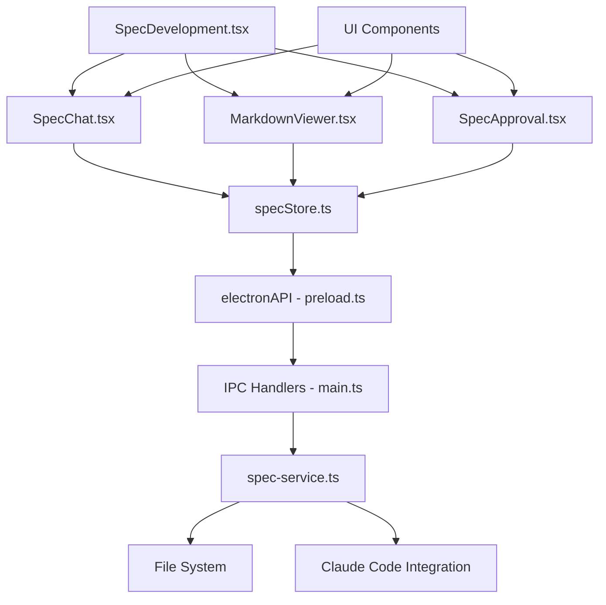

# Spec Development Implementation Details

## Overview

This document provides detailed technical information about the implementation of the Spec Development feature, including code organization, design patterns, performance considerations, and implementation decisions.

## Table of Contents

1. [Project Structure](#project-structure)
2. [Design Patterns](#design-patterns)
3. [Component Implementation](#component-implementation)
4. [State Management Details](#state-management-details)
5. [Backend Service Implementation](#backend-service-implementation)
6. [Performance Optimizations](#performance-optimizations)
7. [Security Considerations](#security-considerations)
8. [Testing Strategy](#testing-strategy)
9. [Build and Deployment](#build-and-deployment)
10. [Future Improvements](#future-improvements)

## Project Structure

### File Organization

```
src/
├── components/
│   └── spec-development/
│       ├── SpecDevelopment.tsx      # Main container component
│       ├── SpecChat.tsx            # Chat interface
│       ├── MarkdownViewer.tsx      # Markdown preview
│       ├── SpecApproval.tsx        # Approval workflow
│       └── components/             # Shared sub-components
├── stores/
│   └── specStore.ts               # Zustand state management
├── lib/
│   └── spec-utils.ts              # Utility functions
└── types/
    └── spec-types.ts              # TypeScript definitions

electron/
├── services/
│   └── spec-service.ts            # Backend service
├── main.ts                        # IPC handler registration
├── preload.ts                     # IPC API exposure
└── preload.d.ts                   # Type definitions

docs/
└── spec-development/
    ├── README.md                  # Overview documentation
    ├── API_REFERENCE.md          # API documentation
    ├── USER_GUIDE.md             # User documentation
    ├── ARCHITECTURE.md           # Architecture details
    ├── INTEGRATION.md            # Integration guide
    └── IMPLEMENTATION_DETAILS.md # This document
```

### Dependency Structure



## Design Patterns

### 1. Container-Presenter Pattern

The main component acts as a container managing state and data flow:

```typescript
// Container Component (SpecDevelopment)
export function SpecDevelopment() {
  const {
    // State subscriptions
    activeProject,
    specifications,
    // Actions
    loadProjectsFromBackend,
    createProject
  } = useSpecStore()

  // Container logic - effects, handlers, data loading
  useEffect(() => {
    loadProjectsFromBackend()
  }, [])

  // Render presentational components
  return (
    <div className="h-full flex flex-col">
      <SpecHeader />
      <SpecContent />
      <SpecFooter />
    </div>
  )
}
```

### 2. Service Layer Pattern

Backend operations are encapsulated in service classes:

```typescript
class SpecService {
  private readonly specDir: string
  private readonly configFile: string

  // Encapsulated business logic
  async createProject(projectData: ProjectData): Promise<SpecProject> {
    // Validation, file operations, external integrations
  }

  // Private utility methods
  private ensureSpecDirectory(): void { }
  private generateId(): string { }
}

// Single instance exported
export const specService = new SpecService()
```

### 3. Repository Pattern (File Operations)

File system operations abstracted through repository-like interface:

```typescript
interface SpecificationRepository {
  save(projectId: string, spec: Specification): Promise<void>
  load(projectId: string): Promise<Specification[]>
  delete(projectId: string, specId: string): Promise<void>
  exists(projectId: string, specId: string): Promise<boolean>
}

class FileSystemSpecRepository implements SpecificationRepository {
  private readonly basePath: string

  async save(projectId: string, spec: Specification): Promise<void> {
    const metadataPath = this.getMetadataPath(projectId, spec.id)
    const contentPath = this.getContentPath(projectId, spec.id)

    await Promise.all([
      fs.writeFile(metadataPath, JSON.stringify(spec, null, 2)),
      fs.writeFile(contentPath, spec.content)
    ])
  }
}
```

### 4. Command Pattern (Chat Commands)

Commands encapsulated as objects with execute methods:

```typescript
interface Command {
  command: string
  description: string
  execute(content: string, context: CommandContext): Promise<string>
}

class SpecifyCommand implements Command {
  command = '/specify'
  description = 'Generate a new specification'

  async execute(content: string, context: CommandContext): Promise<string> {
    const prompt = this.buildSpecificationPrompt(content, context)
    return await this.claudeCodeService.generate(prompt)
  }

  private buildSpecificationPrompt(content: string, context: CommandContext): string {
    // Prompt engineering logic
  }
}

class CommandRegistry {
  private commands = new Map<string, Command>()

  register(command: Command): void {
    this.commands.set(command.command, command)
  }

  async execute(commandStr: string, content: string, context: CommandContext): Promise<string> {
    const command = this.commands.get(commandStr)
    if (!command) {
      throw new Error(`Unknown command: ${commandStr}`)
    }
    return await command.execute(content, context)
  }
}
```

### 5. Observer Pattern (Store Updates)

Zustand provides reactive state updates:

```typescript
const useSpecStore = create<SpecStore>((set, get) => ({
  specifications: [],

  // Actions notify all subscribers
  addSpecification: (spec) => {
    set(state => ({
      specifications: [...state.specifications, spec]
    }))

    // Notify external observers
    get().notifySpecificationAdded?.(spec)
  }
}))

// Components automatically re-render on relevant state changes
function SpecList() {
  const specifications = useSpecStore(state => state.specifications)
  // Re-renders when specifications array changes
}
```

## Component Implementation

### SpecDevelopment (Main Container)

```typescript
interface SpecDevelopmentProps {
  // No external props - manages its own state
}

export function SpecDevelopment() {
  // State management
  const {
    viewMode,
    setViewMode,
    activeProject,
    specifications,
    loadProjectsFromBackend,
    createProject
  } = useSpecStore()

  // Initialization effects
  useEffect(() => {
    const initializeData = async () => {
      await loadProjectsFromBackend()

      // Create default project if none exists
      const currentProjects = useSpecStore.getState().projects
      if (currentProjects.length === 0) {
        await createProject({
          name: 'Default Project',
          description: 'Default project for specifications',
          path: './specs',
          isActive: true
        })
      }
    }

    initializeData()
  }, [])

  // Event handlers
  const handleCreateProject = useCallback(async () => {
    const projectName = prompt('Enter project name:')
    if (projectName) {
      try {
        await createProject({
          name: projectName,
          description: `Project for ${projectName}`,
          path: `./specs/${projectName.toLowerCase().replace(/\s+/g, '-')}`,
          isActive: true
        })
      } catch (error) {
        console.error('Failed to create project:', error)
      }
    }
  }, [createProject])

  // Layout management
  const renderContent = () => {
    switch (viewMode) {
      case 'chat':
        return <SpecChat />
      case 'preview':
        return <MarkdownViewer />
      case 'split':
      default:
        return (
          <>
            <div className="flex-1 border-r border-white/10">
              <SpecChat />
            </div>
            <div className="flex-1">
              <MarkdownViewer />
            </div>
          </>
        )
    }
  }

  return (
    <div className="h-full flex flex-col">
      {/* Header with controls */}
      <SpecHeader
        onCreateProject={handleCreateProject}
        viewMode={viewMode}
        onViewModeChange={setViewMode}
      />

      {/* Project info bar */}
      {activeProject && (
        <ProjectInfoBar project={activeProject} specCount={specifications.length} />
      )}

      {/* Main content area */}
      <div className="flex-1 flex min-h-0">
        {renderContent()}
      </div>

      {/* Status/action bar */}
      <SpecFooter />
    </div>
  )
}
```

### SpecChat (Interactive Chat)

```typescript
interface Message {
  id: string
  type: 'user' | 'assistant' | 'system'
  content: string
  timestamp: Date
  metadata?: MessageMetadata
}

export function SpecChat() {
  // Local state
  const [input, setInput] = useState('')
  const [showCommands, setShowCommands] = useState(false)
  const messagesEndRef = useRef<HTMLDivElement>(null)

  // Store state
  const {
    messages,
    isGenerating,
    executeCommand,
    addMessage
  } = useSpecStore()

  // Auto-scroll to bottom
  useEffect(() => {
    messagesEndRef.current?.scrollIntoView({ behavior: 'smooth' })
  }, [messages])

  // Command handling
  const handleSubmit = useCallback(async (e: React.FormEvent) => {
    e.preventDefault()
    if (!input.trim() || isGenerating) return

    const trimmedInput = input.trim()

    if (trimmedInput.startsWith('/')) {
      // Parse command
      const [command, ...contentParts] = trimmedInput.split(' ')
      const content = contentParts.join(' ')

      if (SPEC_COMMANDS.some(cmd => cmd.command === command)) {
        await executeCommand(command, content)
      } else {
        addMessage({
          type: 'system',
          content: `Unknown command: ${command}`
        })
      }
    } else {
      // Regular message
      addMessage({
        type: 'user',
        content: trimmedInput
      })
    }

    setInput('')
    setShowCommands(false)
  }, [input, isGenerating, executeCommand, addMessage])

  // Command suggestions
  const handleInputChange = useCallback((e: React.ChangeEvent<HTMLInputElement>) => {
    const value = e.target.value
    setInput(value)
    setShowCommands(value.startsWith('/') && value.length > 1)
  }, [])

  return (
    <div className="h-full flex flex-col">
      <ChatHeader />
      <MessageList messages={messages} />
      {showCommands && <CommandSuggestions input={input} onSelect={insertCommand} />}
      <ChatInput
        value={input}
        onChange={handleInputChange}
        onSubmit={handleSubmit}
        disabled={isGenerating}
      />
    </div>
  )
}
```

### MarkdownViewer (Preview Panel)

```typescript
interface MarkdownViewerProps {
  // Uses store state - no external props needed
}

export function MarkdownViewer() {
  const [isEditing, setIsEditing] = useState(false)
  const [editContent, setEditContent] = useState('')

  const {
    currentSpec,
    updateSpec,
    setShowApprovalDialog,
    setSelectedSpecId
  } = useSpecStore()

  // Markdown rendering with custom components
  const markdownComponents = useMemo(() => ({
    code({ node, inline, className, children, ...props }: any) {
      const match = /language-(\w+)/.exec(className || '')
      return !inline && match ? (
        <SyntaxHighlighter
          style={vscDarkPlus}
          language={match[1]}
          customStyle={{
            background: 'rgba(255, 255, 255, 0.1)',
            border: '1px solid rgba(255, 255, 255, 0.2)',
            borderRadius: '8px'
          }}
          {...props}
        >
          {String(children).replace(/\n$/, '')}
        </SyntaxHighlighter>
      ) : (
        <code className="bg-white/10 px-1.5 py-0.5 rounded text-sm border border-white/20" {...props}>
          {children}
        </code>
      )
    },
    table({ children, ...props }: any) {
      return (
        <div className="overflow-x-auto">
          <table className="min-w-full border border-white/20 rounded-lg" {...props}>
            {children}
          </table>
        </div>
      )
    }
    // Additional custom components...
  }), [])

  // Edit handlers
  const handleEdit = useCallback(() => {
    if (currentSpec) {
      setEditContent(currentSpec.content)
      setIsEditing(true)
    }
  }, [currentSpec])

  const handleSave = useCallback(() => {
    if (currentSpec) {
      updateSpec(currentSpec.id, { content: editContent })
      setIsEditing(false)
    }
  }, [currentSpec, editContent, updateSpec])

  if (!currentSpec) {
    return <EmptyState />
  }

  return (
    <div className="h-full flex flex-col">
      <ViewerHeader
        spec={currentSpec}
        isEditing={isEditing}
        onEdit={handleEdit}
        onSave={handleSave}
        onCancel={() => setIsEditing(false)}
      />

      <div className="flex-1 overflow-auto">
        {isEditing ? (
          <MarkdownEditor
            value={editContent}
            onChange={setEditContent}
          />
        ) : (
          <div className="p-6">
            <ReactMarkdown
              remarkPlugins={[remarkGfm]}
              components={markdownComponents}
              className="prose prose-invert prose-sm max-w-none"
            >
              {currentSpec.content}
            </ReactMarkdown>
          </div>
        )}
      </div>

      {currentSpec.status === 'draft' && !isEditing && (
        <ApprovalFooter
          spec={currentSpec}
          onApprove={() => {
            setSelectedSpecId(currentSpec.id)
            setShowApprovalDialog(true)
          }}
        />
      )}
    </div>
  )
}
```

## State Management Details

### Store Structure and Organization

```typescript
interface SpecStore {
  // Data state - normalized for efficient updates
  entities: {
    projects: Record<string, SpecProject>
    specifications: Record<string, Specification>
    messages: Record<string, ChatMessage>
  }

  // UI state - separate from data
  ui: {
    activeProjectId: string | null
    currentSpecId: string | null
    selectedSpecId: string | null
    viewMode: ViewMode
    showApprovalDialog: boolean
    isGenerating: boolean
  }

  // Derived state - computed properties
  derived: {
    activeProject: SpecProject | null
    currentSpec: Specification | null
    messageList: ChatMessage[]
    specificationList: Specification[]
  }
}
```

### Optimized Store Implementation

```typescript
export const useSpecStore = create<SpecStore>()(
  subscribeWithSelector((set, get) => ({
    // Entities storage
    entities: {
      projects: {},
      specifications: {},
      messages: {}
    },

    // UI state
    ui: {
      activeProjectId: null,
      currentSpecId: null,
      selectedSpecId: null,
      viewMode: 'split',
      showApprovalDialog: false,
      isGenerating: false
    },

    // Computed selectors
    get activeProject() {
      const { activeProjectId } = get().ui
      return activeProjectId ? get().entities.projects[activeProjectId] || null : null
    },

    get currentSpec() {
      const { currentSpecId } = get().ui
      return currentSpecId ? get().entities.specifications[currentSpecId] || null : null
    },

    get messages() {
      return Object.values(get().entities.messages).sort(
        (a, b) => a.timestamp.getTime() - b.timestamp.getTime()
      )
    },

    // Actions with optimistic updates
    addMessage: (message) => {
      const id = crypto.randomUUID()
      const timestamp = new Date()

      set(state => ({
        entities: {
          ...state.entities,
          messages: {
            ...state.entities.messages,
            [id]: { ...message, id, timestamp }
          }
        }
      }))
    },

    // Async actions with error handling
    executeCommand: async (command, content) => {
      const { ui, entities } = get()

      set(state => ({
        ui: { ...state.ui, isGenerating: true }
      }))

      try {
        // Add user message optimistically
        get().addMessage({
          type: 'user',
          content: `${command} ${content}`,
          metadata: { command }
        })

        // Execute command
        const response = await window.electronAPI.specExecuteCommand(
          command,
          content,
          get().activeProject?.path || './specs'
        )

        // Handle response based on command type
        if (command === '/specify') {
          const specId = crypto.randomUUID()
          const spec: Specification = {
            id: specId,
            title: `Specification: ${content}`,
            description: content,
            content: response,
            status: 'draft',
            tags: ['auto-generated'],
            createdAt: new Date(),
            updatedAt: new Date(),
            version: 1
          }

          // Update entities
          set(state => ({
            entities: {
              ...state.entities,
              specifications: {
                ...state.entities.specifications,
                [specId]: spec
              }
            },
            ui: {
              ...state.ui,
              currentSpecId: specId
            }
          }))

          // Save to backend
          const activeProject = get().activeProject
          if (activeProject) {
            try {
              await window.electronAPI.specSaveSpecification(activeProject.id, spec)
            } catch (error) {
              console.error('Failed to save specification:', error)
            }
          }
        }

        // Add assistant response
        get().addMessage({
          type: 'assistant',
          content: command === '/specify'
            ? `I've created a comprehensive specification for "${content}". Please review it in the preview panel.`
            : response
        })

      } catch (error) {
        get().addMessage({
          type: 'system',
          content: `Error executing command: ${error instanceof Error ? error.message : 'Unknown error'}`
        })
      } finally {
        set(state => ({
          ui: { ...state.ui, isGenerating: false }
        }))
      }
    }
  }))
)
```

### Performance Optimizations

#### Selective Subscriptions

```typescript
// Only subscribe to specific state slices
function MessageList() {
  const messages = useSpecStore(state => state.messages)
  // Only re-renders when messages change
}

function ViewModeToggle() {
  const { viewMode, setViewMode } = useSpecStore(
    state => ({
      viewMode: state.ui.viewMode,
      setViewMode: state.setViewMode
    }),
    shallow // Shallow comparison for object
  )
}
```

#### Memoization

```typescript
// Memoize expensive computations
const useFilteredMessages = (filter: string) => {
  return useSpecStore(
    state => state.messages.filter(msg =>
      msg.content.toLowerCase().includes(filter.toLowerCase())
    ),
    (a, b) => a.length === b.length && a.every((msg, i) => msg.id === b[i].id)
  )
}

// Memoize component rendering
const MessageItem = React.memo(({ message }: { message: ChatMessage }) => {
  return (
    <div className="message">
      {/* Message rendering */}
    </div>
  )
}, (prevProps, nextProps) => {
  return prevProps.message.id === nextProps.message.id &&
         prevProps.message.content === nextProps.message.content
})
```

## Backend Service Implementation

### Service Architecture

```typescript
class SpecService {
  private readonly specDir: string
  private readonly configFile: string
  private cache: Map<string, any> = new Map()

  constructor() {
    this.specDir = path.join(os.homedir(), '.claude-sentinel', 'specs')
    this.configFile = path.join(this.specDir, 'config.json')
    this.ensureSpecDirectory()
  }

  // Project operations with caching
  async getProjects(): Promise<SpecProject[]> {
    const cacheKey = 'projects'

    if (this.cache.has(cacheKey)) {
      return this.cache.get(cacheKey)
    }

    const projects = await this.loadProjectsFromDisk()
    this.cache.set(cacheKey, projects)

    return projects
  }

  // Specification operations with atomic writes
  async saveSpecification(projectId: string, spec: Specification): Promise<void> {
    const projectPath = path.join(this.specDir, 'projects', projectId)
    const specsPath = path.join(projectPath, 'specs')

    await fs.mkdir(specsPath, { recursive: true })

    // Atomic writes using temporary files
    const tempMetadata = path.join(specsPath, `.${spec.id}.json.tmp`)
    const tempContent = path.join(specsPath, `.${spec.id}.md.tmp`)

    const finalMetadata = path.join(specsPath, `${spec.id}.json`)
    const finalContent = path.join(specsPath, `${spec.id}.md`)

    try {
      // Write to temporary files
      await Promise.all([
        fs.writeFile(tempMetadata, JSON.stringify(spec, null, 2)),
        fs.writeFile(tempContent, spec.content)
      ])

      // Atomic rename
      await Promise.all([
        fs.rename(tempMetadata, finalMetadata),
        fs.rename(tempContent, finalContent)
      ])

      // Invalidate cache
      this.cache.delete(`specs-${projectId}`)

    } catch (error) {
      // Cleanup temporary files on error
      await Promise.all([
        fs.unlink(tempMetadata).catch(() => {}),
        fs.unlink(tempContent).catch(() => {})
      ])
      throw error
    }
  }

  // Claude Code integration with retry logic
  async executeClaudeCodeCommand(
    command: string,
    content: string,
    projectPath: string,
    window?: BrowserWindow
  ): Promise<string> {
    const maxRetries = 3
    let lastError: Error

    for (let attempt = 1; attempt <= maxRetries; attempt++) {
      try {
        const response = await this.attemptCommandExecution(command, content, projectPath)
        return response
      } catch (error) {
        lastError = error as Error

        if (attempt < maxRetries) {
          // Exponential backoff
          const delay = Math.pow(2, attempt) * 1000
          await new Promise(resolve => setTimeout(resolve, delay))
        }
      }
    }

    throw lastError
  }

  private async attemptCommandExecution(
    command: string,
    content: string,
    projectPath: string
  ): Promise<string> {
    const fullPrompt = this.buildSpecKitPrompt(command, content)

    // Current implementation returns mock response
    // Future: Replace with actual Claude Code integration
    await this.simulateProcessingDelay()
    return this.generateMockResponse(command, content)
  }

  private async simulateProcessingDelay(): Promise<void> {
    // Simulate realistic processing time
    const delay = 1000 + Math.random() * 2000 // 1-3 seconds
    await new Promise(resolve => setTimeout(resolve, delay))
  }
}
```

### Error Handling and Logging

```typescript
class SpecService {
  private logger = new Logger('SpecService')

  async createProject(projectData: ProjectData): Promise<SpecProject> {
    this.logger.info('Creating project', { name: projectData.name })

    try {
      // Validation
      this.validateProjectData(projectData)

      // Create project
      const project = await this.performProjectCreation(projectData)

      this.logger.info('Project created successfully', {
        id: project.id,
        name: project.name
      })

      return project

    } catch (error) {
      this.logger.error('Failed to create project', {
        error: error.message,
        projectData,
        stack: error.stack
      })

      // Re-throw with user-friendly message
      throw new Error(`Failed to create project "${projectData.name}": ${error.message}`)
    }
  }

  private validateProjectData(data: ProjectData): void {
    if (!data.name?.trim()) {
      throw new Error('Project name is required')
    }

    if (data.name.length > 100) {
      throw new Error('Project name must be less than 100 characters')
    }

    // Additional validation...
  }
}

class Logger {
  constructor(private component: string) {}

  info(message: string, data?: any): void {
    console.log(`[${this.component}] ${message}`, data)
  }

  error(message: string, data?: any): void {
    console.error(`[${this.component}] ${message}`, data)
  }
}
```

## Performance Optimizations

### Frontend Optimizations

#### Component-Level Optimizations

```typescript
// Virtualization for large message lists
import { FixedSizeList as List } from 'react-window'

const VirtualizedMessageList = ({ messages }: { messages: ChatMessage[] }) => {
  const Row = ({ index, style }: { index: number; style: React.CSSProperties }) => (
    <div style={style}>
      <MessageItem message={messages[index]} />
    </div>
  )

  return (
    <List
      height={400}
      itemCount={messages.length}
      itemSize={60}
      width="100%"
    >
      {Row}
    </List>
  )
}

// Debounced search
const useDebounce = <T>(value: T, delay: number): T => {
  const [debouncedValue, setDebouncedValue] = useState<T>(value)

  useEffect(() => {
    const handler = setTimeout(() => {
      setDebouncedValue(value)
    }, delay)

    return () => {
      clearTimeout(handler)
    }
  }, [value, delay])

  return debouncedValue
}

// Memoized search results
const useSpecificationSearch = (query: string) => {
  const debouncedQuery = useDebounce(query, 300)
  const specifications = useSpecStore(state => state.specifications)

  return useMemo(() => {
    if (!debouncedQuery) return specifications

    return specifications.filter(spec =>
      spec.title.toLowerCase().includes(debouncedQuery.toLowerCase()) ||
      spec.content.toLowerCase().includes(debouncedQuery.toLowerCase()) ||
      spec.tags.some(tag => tag.toLowerCase().includes(debouncedQuery.toLowerCase()))
    )
  }, [specifications, debouncedQuery])
}
```

#### Bundle Optimization

```typescript
// Lazy loading for spec development components
const SpecDevelopment = lazy(() => import('./components/spec-development/SpecDevelopment'))

// Code splitting by route
const App = () => (
  <Router>
    <Routes>
      <Route
        path="/spec-development"
        element={
          <Suspense fallback={<LoadingSpinner />}>
            <SpecDevelopment />
          </Suspense>
        }
      />
    </Routes>
  </Router>
)

// Dynamic imports for heavy dependencies
const loadMarkdownEditor = async () => {
  const { default: MDEditor } = await import('@uiw/react-md-editor')
  return MDEditor
}
```

### Backend Optimizations

#### Caching Strategy

```typescript
class CacheManager {
  private cache = new Map<string, { data: any; expiry: number }>()
  private readonly TTL = 5 * 60 * 1000 // 5 minutes

  set(key: string, data: any): void {
    this.cache.set(key, {
      data,
      expiry: Date.now() + this.TTL
    })
  }

  get<T>(key: string): T | null {
    const entry = this.cache.get(key)

    if (!entry) return null

    if (Date.now() > entry.expiry) {
      this.cache.delete(key)
      return null
    }

    return entry.data as T
  }

  invalidate(pattern: string): void {
    for (const key of this.cache.keys()) {
      if (key.includes(pattern)) {
        this.cache.delete(key)
      }
    }
  }
}

// Usage in SpecService
class SpecService {
  private cache = new CacheManager()

  async getProjects(): Promise<SpecProject[]> {
    const cached = this.cache.get<SpecProject[]>('projects')
    if (cached) return cached

    const projects = await this.loadProjectsFromDisk()
    this.cache.set('projects', projects)

    return projects
  }
}
```

#### File System Optimizations

```typescript
// Batch file operations
class BatchFileOperations {
  private pendingWrites: Array<{ path: string; data: string }> = []
  private flushTimeout?: NodeJS.Timeout

  queueWrite(path: string, data: string): void {
    this.pendingWrites.push({ path, data })

    // Debounce flush
    if (this.flushTimeout) {
      clearTimeout(this.flushTimeout)
    }

    this.flushTimeout = setTimeout(() => {
      this.flush()
    }, 1000)
  }

  private async flush(): Promise<void> {
    if (this.pendingWrites.length === 0) return

    const writes = [...this.pendingWrites]
    this.pendingWrites = []

    await Promise.all(
      writes.map(({ path, data }) => fs.writeFile(path, data))
    )
  }
}

// Streaming for large files
async function streamLargeMarkdownFile(filePath: string): Promise<string> {
  const stream = fs.createReadStream(filePath, { encoding: 'utf8' })
  const chunks: string[] = []

  for await (const chunk of stream) {
    chunks.push(chunk)
  }

  return chunks.join('')
}
```

## Security Considerations

### Input Validation

```typescript
// Sanitize user inputs
import DOMPurify from 'dompurify'

class SecurityUtils {
  static sanitizeHtml(html: string): string {
    return DOMPurify.sanitize(html, {
      ALLOWED_TAGS: ['p', 'br', 'strong', 'em', 'code', 'pre', 'blockquote'],
      ALLOWED_ATTR: ['class']
    })
  }

  static validateProjectName(name: string): boolean {
    // Allow alphanumeric, spaces, hyphens, underscores
    const validPattern = /^[a-zA-Z0-9\s\-_]{1,50}$/
    return validPattern.test(name)
  }

  static sanitizeFilePath(path: string): string {
    // Remove dangerous characters
    return path.replace(/[<>:"|?*]/g, '').replace(/\.\./g, '')
  }
}

// Validate inputs in service
class SpecService {
  async createProject(projectData: ProjectData): Promise<SpecProject> {
    if (!SecurityUtils.validateProjectName(projectData.name)) {
      throw new Error('Invalid project name')
    }

    const sanitizedPath = SecurityUtils.sanitizeFilePath(projectData.path || '')

    // Continue with creation...
  }
}
```

### File System Security

```typescript
class SecureFileOperations {
  private readonly allowedBasePath: string

  constructor() {
    this.allowedBasePath = path.join(os.homedir(), '.claude-sentinel')
  }

  private validatePath(filePath: string): void {
    const resolvedPath = path.resolve(filePath)

    if (!resolvedPath.startsWith(this.allowedBasePath)) {
      throw new Error('Access denied: Path outside allowed directory')
    }
  }

  async readFile(filePath: string): Promise<string> {
    this.validatePath(filePath)
    return await fs.readFile(filePath, 'utf8')
  }

  async writeFile(filePath: string, data: string): Promise<void> {
    this.validatePath(filePath)
    await fs.writeFile(filePath, data, 'utf8')
  }
}
```

### IPC Security

```typescript
// Validate IPC messages
interface IpcMessage {
  command: string
  data: any
}

function validateIpcMessage(message: IpcMessage): boolean {
  // Validate command whitelist
  const allowedCommands = [
    'spec-create-project',
    'spec-get-projects',
    'spec-save-specification',
    // ... other allowed commands
  ]

  if (!allowedCommands.includes(message.command)) {
    return false
  }

  // Validate data structure
  if (typeof message.data !== 'object') {
    return false
  }

  return true
}

// In main process
ipcMain.handle('spec-create-project', async (event, projectData) => {
  if (!validateIpcMessage({ command: 'spec-create-project', data: projectData })) {
    throw new Error('Invalid IPC message')
  }

  // Process request...
})
```

## Testing Strategy

### Unit Tests

```typescript
// Store testing
describe('SpecStore', () => {
  beforeEach(() => {
    useSpecStore.setState({
      entities: { projects: {}, specifications: {}, messages: {} },
      ui: { activeProjectId: null, currentSpecId: null, /* ... */ }
    })
  })

  it('should add message correctly', () => {
    const { addMessage } = useSpecStore.getState()

    addMessage({
      type: 'user',
      content: 'Test message'
    })

    const messages = useSpecStore.getState().messages
    expect(messages).toHaveLength(1)
    expect(messages[0].content).toBe('Test message')
    expect(messages[0].type).toBe('user')
  })

  it('should handle command execution', async () => {
    const mockApi = {
      specExecuteCommand: jest.fn().mockResolvedValue('Mock response')
    }

    // Mock window.electronAPI
    global.window = { electronAPI: mockApi } as any

    const { executeCommand } = useSpecStore.getState()
    await executeCommand('/specify', 'Test content')

    expect(mockApi.specExecuteCommand).toHaveBeenCalledWith(
      '/specify',
      'Test content',
      expect.any(String)
    )
  })
})
```

### Component Tests

```typescript
// Component testing with React Testing Library
import { render, screen, fireEvent, waitFor } from '@testing-library/react'
import { SpecChat } from './SpecChat'

// Mock the store
jest.mock('@/stores/specStore', () => ({
  useSpecStore: () => ({
    messages: [],
    isGenerating: false,
    executeCommand: jest.fn(),
    addMessage: jest.fn()
  })
}))

describe('SpecChat', () => {
  it('should handle user input', async () => {
    render(<SpecChat />)

    const input = screen.getByPlaceholderText(/Type a command/)
    const submitButton = screen.getByRole('button', { name: /send/i })

    fireEvent.change(input, { target: { value: '/specify Test app' } })
    fireEvent.click(submitButton)

    await waitFor(() => {
      expect(mockExecuteCommand).toHaveBeenCalledWith('/specify', 'Test app')
    })
  })

  it('should show command suggestions', () => {
    render(<SpecChat />)

    const input = screen.getByPlaceholderText(/Type a command/)
    fireEvent.change(input, { target: { value: '/spec' } })

    expect(screen.getByText('/specify')).toBeInTheDocument()
  })
})
```

### Integration Tests

```typescript
// End-to-end workflow testing
describe('Spec Development Integration', () => {
  it('should complete full specification workflow', async () => {
    // 1. Create project
    const createProjectBtn = screen.getByText('New Project')
    fireEvent.click(createProjectBtn)

    // Mock prompt
    jest.spyOn(window, 'prompt').mockReturnValue('Test Project')

    await waitFor(() => {
      expect(screen.getByText('Test Project')).toBeInTheDocument()
    })

    // 2. Execute specification command
    const input = screen.getByPlaceholderText(/Type a command/)
    fireEvent.change(input, { target: { value: '/specify Build a todo app' } })

    const submitBtn = screen.getByRole('button', { name: /send/i })
    fireEvent.click(submitBtn)

    // 3. Wait for response
    await waitFor(() => {
      expect(screen.getByText(/comprehensive specification/i)).toBeInTheDocument()
    })

    // 4. Approve specification
    const approveBtn = screen.getByText('Review & Approve')
    fireEvent.click(approveBtn)

    const finalApproveBtn = screen.getByText('Approve')
    fireEvent.click(finalApproveBtn)

    // 5. Verify final state
    await waitFor(() => {
      expect(screen.getByText('approved')).toBeInTheDocument()
    })
  })
})
```

## Build and Deployment

### Build Configuration

```typescript
// vite.config.ts updates for spec development
export default defineConfig({
  // ... existing config
  build: {
    rollupOptions: {
      output: {
        manualChunks: {
          'spec-development': [
            './src/components/spec-development/SpecDevelopment.tsx',
            './src/components/spec-development/SpecChat.tsx',
            './src/components/spec-development/MarkdownViewer.tsx',
            './src/stores/specStore.ts'
          ],
          'markdown-rendering': [
            'react-markdown',
            'remark-gfm',
            'react-syntax-highlighter'
          ]
        }
      }
    }
  }
})
```

### Electron Build Updates

```json
{
  "build": {
    "files": [
      "dist/**/*",
      "build/**/*",
      "node_modules/**/*",
      "!node_modules/**/test/**/*",
      "!node_modules/**/tests/**/*"
    ],
    "extraFiles": [
      {
        "from": "docs/spec-development",
        "to": "resources/docs/spec-development"
      }
    ]
  }
}
```

## Future Improvements

### Performance Enhancements

1. **Web Workers**: Move heavy computations (markdown parsing, search) to web workers
2. **Database Integration**: Replace file system with SQLite for better performance
3. **Incremental Loading**: Load specifications on demand rather than all at once
4. **Content Streaming**: Stream large specification content

### Feature Enhancements

1. **Real-time Collaboration**: Multi-user editing with operational transforms
2. **Advanced Templates**: Smart templates with variables and logic
3. **AI Improvements**: Better context awareness and learning from user feedback
4. **Integration Ecosystem**: Plugin system for external tool integrations

### Architecture Improvements

1. **Microservices**: Split backend into multiple focused services
2. **Event Sourcing**: Track all changes as events for better audit trails
3. **CQRS**: Separate read and write models for better performance
4. **GraphQL**: More efficient data fetching with GraphQL API

This implementation provides a solid foundation for the Spec Development feature while maintaining flexibility for future enhancements and optimizations.